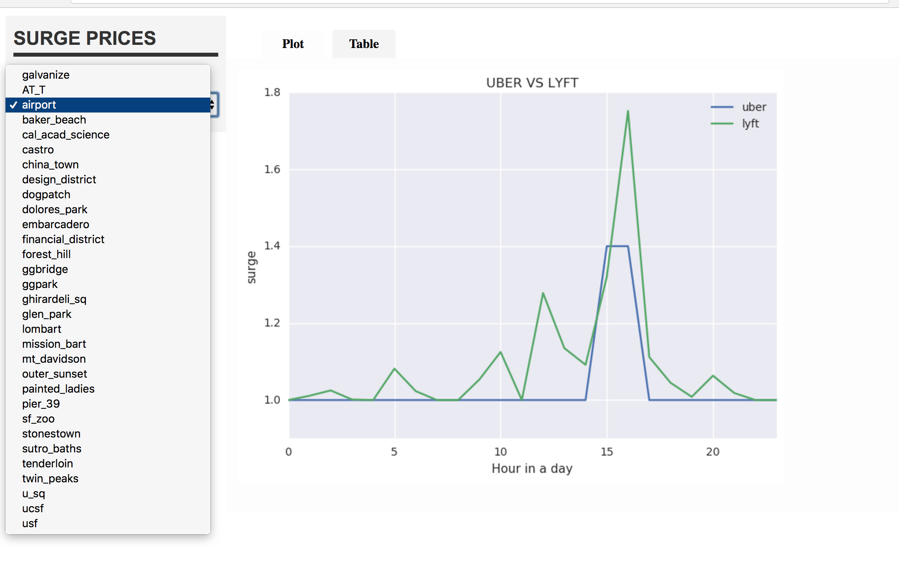

# UBER-VS-LYFT
Surge analysis

#Kinesis

>1. Setup Kinesis firehose on aws

>2. Specify the bucket names that you want to direct the firehose to

>3. Use the cronjob to run uber_lyft_api_call.py every 2 minutes

#Spark

>1. Read raw data from s3

>2. Create Spark dataFrames in 3 nf

>3. Store them in s3 as parquet for backup

#PostgreSQL

>1. Create 2 tables : Uber and Lyft

>2. Read data into each table from the spark script

#Webapp

>Run Spyre on a new EC2 instance, Use the final_spyre.py.

#

## 8 properties for Big Data systems :

## Robustness and fault Tolerance

>Since all the systems used belong to AWS. All systems used for the project neatly integrates with one another, with good Robustness. 

>All the raw data required is stored in s3. Incase some system fails, the data can still be used to recompute the desired results.

# Low latency reads and updates

>Using kanesis to store the data in s3 and reading this data off of s3 shouldn't take long.

>When it comes to the analysis of historical surge data, Latency is not very important. But, using spark cuts down thelatency on general by avoiding unnecessary disk i/o.

# Scalability

>S3 is good enough to hold huge amount of data.

# Generalization

>This architecture can be reused for a lot of applications. Especially for comparing two online  services

# Extensibility

>Apart from the sysytems that store the raw data, any of the system can be replaced with a better ones if there are any available. or may be for a different application, using the same data.

>example : Kafka can be used instead of Kenisis. Hadoop can be used instead of spark , if thats appropriate. Hbase or cassandra can be used instead of postgresql.

# Ad hoc queries

>PostgreSQL will be used to do ad hoc queries.

# Minimal maintainance

>As all the components are maintained AWS, there is very less to worry about interms of maintainance.

>When it comes to scale, the postgresql can be of a problem. This an be replaced with an appropriate rdbms system.

# Debuggability

>I will be having some checkpoints at some stages in my pipeline, to make sure that everything is running as planned. These checkpoints can be like a mail to notify myself the amount/count of data that I have collected.If the RDBMS crashes, there will be a parquet on s3 to fall back on. 

